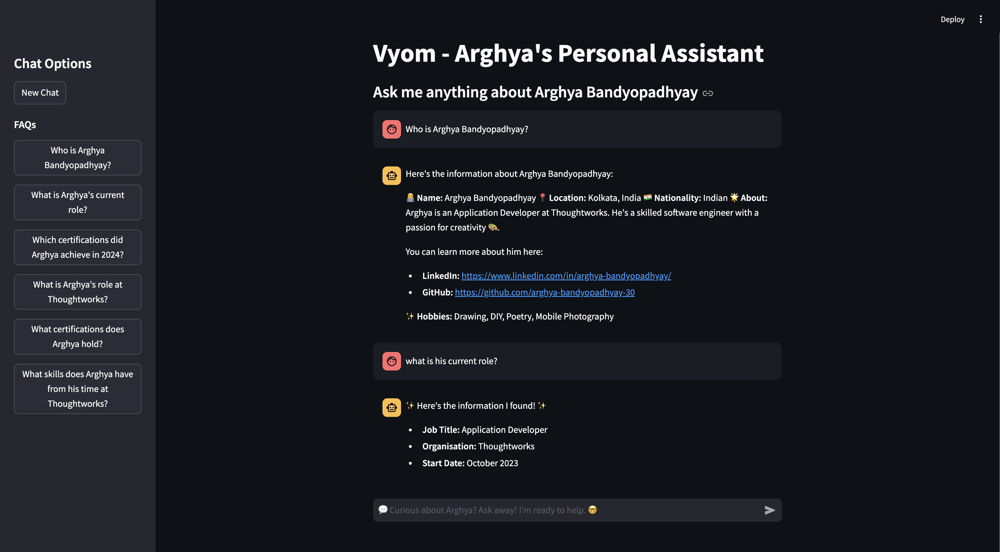

# Vyom Chatbot
Vyom is a personal assistant chatbot built to answer questions about Arghya Bandyopadhyay. It uses a combination of Neo4j for knowledge graph management, Streamlit for frontend interface, and a language model for intelligent query handling.

## Table of Contents
1. [Introduction](#introduction)
2. [Features](#features)
3. [Architecture](#architecture)
4. [Flow Diagram](#flow-diagram)
5. [Screenshot](#screenshot)
5. [Installation](#installation)
6. [Usage](#usage)
7. [Technologies Used](#technologies-used)
8. [Configuration](#configuration)
9. [License](#license)

## Introduction
Vyom is designed to provide detailed and accurate responses to inquiries about Arghya, such as educational background, projects, skills, recommendations, and more. Vyom makes use of natural language processing techniques to interpret queries, generate responses, and continuously learn from its interactions.

## Features

1. **Personalized Responses:** Vyom can answer specific questions about Arghya with context-aware replies.
2. **Graph-based Knowledge Retrieval:** Utilizes Neo4j to store and retrieve knowledge about Arghya.
3. **Sentiment Analysis:** Analyzes blog content and recommendations using VADER sentiment analysis.
4. **Interactive Chat UI:** Frontend built with Streamlit to facilitate smooth interaction with Vyom.

## Architecture

Vyom follows a modular architecture:
1. **Backend:** Python-based services for ingestion, and LLM interaction.
2. **Knowledge Graph:** Neo4j for storing relationships such as skills, education, projects, etc.
3. **LLM:** Groq model integration for language processing and understanding user queries.
4. **Frontend:** Streamlit application to interact with users.

## Flow Diagram

1. User interacts via the Streamlit UI.
2. Queries are processed by the LLM to classify, fetch data, or generate responses.
3. Data is retrieved from Neo4j using Cypher queries.
4. The response is formatted and sent back to the user through the chat UI.

## Screenshot



## Installation

### Prerequisites

1. Python 3.11
2. Neo4j (for knowledge graph storage)
3. Streamlit (for UI)

### Steps

1. Clone the repository:
```
https://github.com/ArghyaBanerjee30/vyom_my_bot.git
cd vyom-chatbot
```
2. Set up a virtual environment and activate it:
```
conda create -p ./venv python==3.11 -y   
conda activate 
```
3. Install the required dependencies:
```
pip install -r requirements.txt
```
4. Set up Neo4j and copy the [env_template](.env_template) file and rename it to `.env` and update the file with your credentials.

#### CSV Template Setup: 
We have provided CSV templates in the folder: [model_csv_templates](model_csv_templates). Download these files and import them into Google Sheets. Use the public share link in the `.env` file.

## Usage

1. Run the Neo4j database and ensure it is populated with the initial data.
2. Ingest the nodes:
```
python src/pipeline/run.py config.yml 
```
3. Start the Streamlit application:
```
streamlit run src/app/web_app.py
```
4. Use the chat interface to ask questions like:
   1. _"Who is Arghya Bandyopadhyay?"_
   2. _"What projects has Arghya worked on?"_
5. Click on "New Chat" in the sidebar to begin a new conversation.

## Technologies Used

1. **Python:** Core programming language for backend services.
2. **Neo4j:** Graph database used to manage information about Arghya.
3. **Streamlit:** Framework used for building the chatbot frontend.
4. **VADER Sentiment Analysis:** Used for analyzing sentiments of blogs and recommendations.
5. **Hugging Face:** For embedding service to represent text information.
6. **Groq Model:** For language processing and conversation management.

## Configuration

1. **config.yml:** Main configuration file to automate ingestion process to Neo4j.
2. **app.yml:** Configuration file for setting app details (title, subtitle, etc.) and to automate LLM model.
3. **.env:** Stores environment variables such as API keys, Neo4j credentials, etc.

## License

This project is licensed under the MIT License.